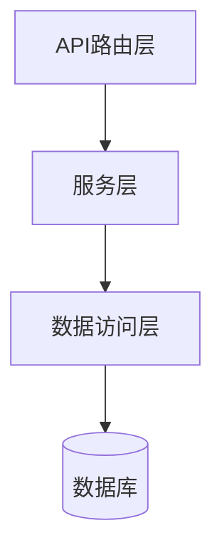
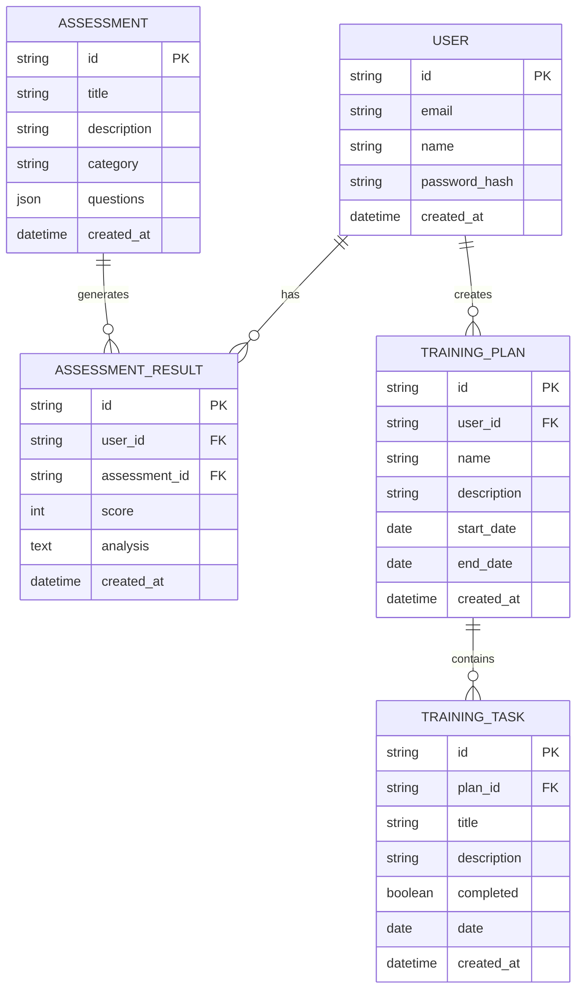

## 1. Architecture Design

```mermaid
graph TB
    subgraph Frontend[前端]
        A[React + TypeScript]
        B[React Router]
        C[Tailwind CSS]
        D[Zustand 状态管理]
    end
    
    subgraph Backend[后端]
        E[Express.js]
        F[认证]
        G[API服务]
    end
    
    subgraph Data[数据层]
        H[(PostgreSQL]
    end
    
    A -->|HTTP请求| E
    E -->|数据操作| H
```

## 2. Technology Description
- 前端：React@18 + TypeScript + Vite
- 后端：Express.js@4
- 状态管理：Zustand
- 样式：Tailwind CSS@3
- 路由：React Router DOM
- 图标：Lucide React
- 数据库：PostgreSQL

## 3. Route Definitions
| Route | Purpose |
|-------|---------|
| / | 首页 |
| /assessments | 测评中心 |
| /assessments/:id | 测评详情/答题 |
| /training | 训练计划 |
| /profile | 个人中心 |
| /login | 登录页 |
| /register | 注册页 |

## 4. API Definitions
```typescript
// 用户相关
interface User {
  id: string;
  email: string;
  name: string;
  createdAt: string;
}

// 测评相关
interface Assessment {
  id: string;
  title: string;
  description: string;
  category: string;
  questions: Question[];
}

interface Question {
  id: string;
  text: string;
  type: 'single' | 'multiple';
  options: Option[];
}

interface Option {
  id: string;
  text: string;
  score: number;
}

interface AssessmentResult {
  id: string;
  userId: string;
  assessmentId: string;
  score: number;
  analysis: string;
  createdAt: string;
}

// 训练计划相关
interface TrainingPlan {
  id: string;
  userId: string;
  name: string;
  description: string;
  tasks: TrainingTask[];
  startDate: string;
  endDate: string;
}

interface TrainingTask {
  id: string;
  title: string;
  description: string;
  completed: boolean;
  date: string;
}

// API 请求/响应
interface ApiResponse&lt;T&gt; {
  success: boolean;
  data?: T;
  error?: string;
}
```

## 5. Server Architecture Diagram



## 6. Data Model

### 6.1 Data Model Definition



### 6.2 Data Definition Language

```sql
-- 用户表
CREATE TABLE users (
    id VARCHAR(36) PRIMARY KEY DEFAULT gen_random_uuid(),
    email VARCHAR(255) UNIQUE NOT NULL,
    name VARCHAR(100) NOT NULL,
    password_hash VARCHAR(255) NOT NULL,
    created_at TIMESTAMP DEFAULT CURRENT_TIMESTAMP
);

-- 测评表
CREATE TABLE assessments (
    id VARCHAR(36) PRIMARY KEY DEFAULT gen_random_uuid(),
    title VARCHAR(200) NOT NULL,
    description TEXT,
    category VARCHAR(50) NOT NULL,
    questions JSONB NOT NULL,
    created_at TIMESTAMP DEFAULT CURRENT_TIMESTAMP
);

-- 测评结果表
CREATE TABLE assessment_results (
    id VARCHAR(36) PRIMARY KEY DEFAULT gen_random_uuid(),
    user_id VARCHAR(36) NOT NULL,
    assessment_id VARCHAR(36) NOT NULL,
    score INTEGER NOT NULL,
    analysis TEXT NOT NULL,
    created_at TIMESTAMP DEFAULT CURRENT_TIMESTAMP
);

-- 训练计划表
CREATE TABLE training_plans (
    id VARCHAR(36) PRIMARY KEY DEFAULT gen_random_uuid(),
    user_id VARCHAR(36) NOT NULL,
    name VARCHAR(200) NOT NULL,
    description TEXT,
    start_date DATE NOT NULL,
    end_date DATE NOT NULL,
    created_at TIMESTAMP DEFAULT CURRENT_TIMESTAMP
);

-- 训练任务表
CREATE TABLE training_tasks (
    id VARCHAR(36) PRIMARY KEY DEFAULT gen_random_uuid(),
    plan_id VARCHAR(36) NOT NULL,
    title VARCHAR(200) NOT NULL,
    description TEXT,
    completed BOOLEAN DEFAULT FALSE,
    date DATE NOT NULL,
    created_at TIMESTAMP DEFAULT CURRENT_TIMESTAMP
);

-- 创建索引
CREATE INDEX idx_assessment_results_user_id ON assessment_results(user_id);
CREATE INDEX idx_training_plans_user_id ON training_plans(user_id);
CREATE INDEX idx_training_tasks_plan_id ON training_tasks(plan_id);
```
