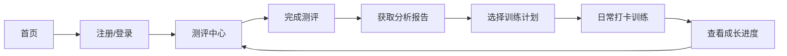

## 1. Product Overview
心理测评与管理训练平台 - 帮助用户了解自我、提升心智水平的全栈应用
- 核心价值：提供科学的心理测评工具、个性化训练计划和进度追踪功能
- 目标用户：关注心理健康、追求自我提升的各类人群

## 2. Core Features

### 2.1 User Roles
| Role | Registration Method | Core Permissions |
|------|---------------------|------------------|
| 普通用户 | 邮箱注册/登录 | 使用测评、制定计划、查看进度 |

### 2.2 Feature Module
1. **首页**: 英雄区、功能导航、热门测评推荐
2. **测评中心**: 各类心理测评题目、结果分析
3. **训练计划**: 个性化训练推荐、任务管理
4. **个人中心**: 用户档案、测评历史、进度展示

### 2.3 Page Details
| Page Name | Module Name | Feature description |
|-----------|-------------|---------------------|
| 首页 | 英雄区 | 引人注目的标题和行动号召按钮 |
| 首页 | 功能导航 | 测评、训练、个人中心三个主要入口 |
| 测评中心 | 测评列表 | 展示各类心理测评问卷卡片 |
| 测评中心 | 测评答题 | 交互式答题界面，支持进度保存 |
| 测评中心 | 结果分析 | 详细的测评结果报告和建议 |
| 训练计划 | 计划推荐 | 基于测评结果推荐个性化训练内容 |
| 训练计划 | 任务管理 | 每日任务打卡、进度记录 |
| 个人中心 | 用户档案 | 个人信息、测评历史、成长曲线 |

## 3. Core Process
用户访问平台 → 注册/登录 → 完成心理测评 → 获取分析报告 → 选择训练计划 → 日常打卡训练 → 查看成长进度

## 4. User Interface Design
### 4.1 Design Style
- 主色调：柔和的蓝色系（宁静、专业），辅以暖色调点缀（活力、温暖）
- 按钮风格：圆角矩形，带有微妙的阴影和过渡动画
- 字体：现代无衬线字体，标题使用更大字号和细体，正文清晰易读
- 布局风格：卡片式布局，层次分明，留白充足
- 图标/emoji风格：简约线性图标，搭配柔和的渐变色

### 4.2 Page Design Overview
| Page Name | Module Name | UI Elements |
|-----------|-------------|-------------|
| 首页 | 英雄区 | 渐变背景、大号标题、简洁CTA按钮、微妙动画 |
| 测评中心 | 测评卡片 | 悬停效果、进度条、简短描述 |
| 测评答题 | 答题界面 | 单选/多选组件、进度指示器、导航按钮 |
| 训练计划 | 任务列表 | 复选框、进度环、打卡动画 |
| 个人中心 | 数据可视化 | 进度图表、统计卡片、时间线 |

### 4.3 Responsiveness
- 桌面端优先设计，自适应平板和移动设备
- 触摸优化：增大可点击区域，简化移动端界面
- 响应式断点：320px, 768px, 1024px, 1440px

### 4.4 3D Scene Guidance
不适用3D场景
